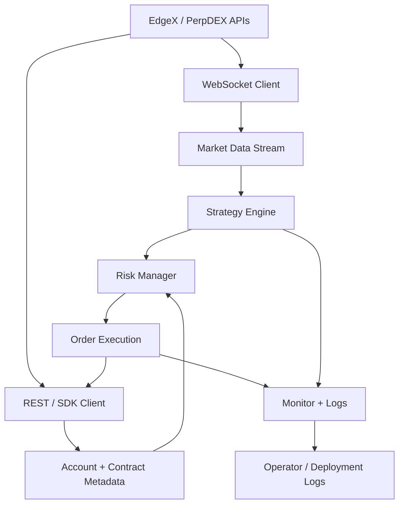
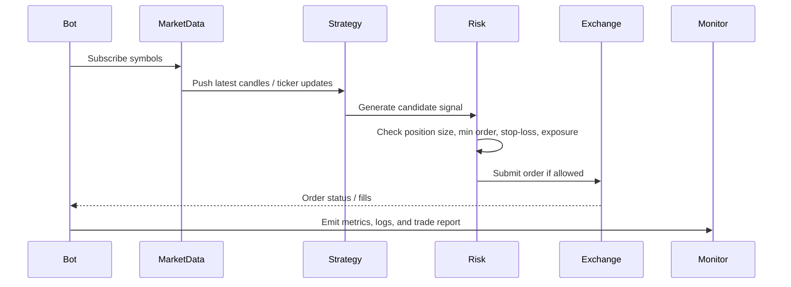

# EdgeX High-Frequency Trading Bot

A production-oriented Python trading bot for EdgeX / PerpDEX-style perpetual markets. The system is designed around async execution, multi-symbol monitoring, risk-controlled order flow, real-time observability, Docker-based deployment, and operational safety.

> This repository is an engineering portfolio project. It demonstrates trading infrastructure, exchange API integration, risk controls, async Python architecture, monitoring, and deployment discipline. It is not financial advice.

## Highlights

- Multi-symbol perpetual futures trading bot for BTC, ETH, SOL, BNB and other supported markets
- Async Python architecture using `asyncio` for concurrent market data, signal evaluation, order flow, and monitoring
- Mean-reversion strategy engine using fast moving-average deviation logic
- Risk controls for position sizing, minimum order size, stop-loss / take-profit behavior, and execution safety
- WebSocket / API client layer for real-time exchange interaction
- Docker and docker-compose deployment for repeatable production operation
- Monitoring and logging modules for live diagnostics, performance reporting, and incident response
- Environment-based configuration with `.env.example` for safer key management

## Architecture



## System design

### Async execution flow



## Repository map

| Path | Purpose |
|---|---|
| `main.py` | Main bot runtime entrypoint |
| `start.py` | Startup wrapper and environment bootstrap |
| `strategy.py` | Trading signal logic and strategy behavior |
| `edgex_client.py` | Exchange API / SDK integration layer |
| `websocket_client.py` | Real-time market data streaming client |
| `monitor.py` | Runtime metrics, logs, and performance reporting |
| `config.py` | Core runtime configuration |
| `config_manager.py` | Config loading and validation logic |
| `Dockerfile` | Container image definition |
| `docker-compose.yml` | One-command deployment setup |
| `.env.example` | Environment variable template |
| `tests / test_*.py` | Functional and integration-style test scripts |

## Strategy overview

The current strategy is a fast-start mean-reversion engine:

1. Pull recent K-line / candle data per symbol.
2. Calculate a short moving average baseline.
3. Detect price deviation from the moving average.
4. Open long or short exposure when deviation crosses a threshold.
5. Manage position with fixed sizing and configured take-profit / stop-loss behavior.
6. Monitor runtime state and execution logs continuously.

This simple strategy is useful as an engineering testbed because it exercises market data, signal generation, risk checks, order placement, and monitoring under a realistic event loop.

## Risk controls

The bot includes multiple layers of operational and trading safety:

- Per-symbol position sizing to avoid overconcentration
- Minimum order size checks per market
- Take-profit and stop-loss parameters
- Contract ID caching to reduce repeated metadata lookups
- Runtime logging for every major decision path
- Dockerized deployment to reduce environment drift
- Environment variables for API credentials instead of hardcoded secrets
- Monitoring reports for diagnosis and live operation

Recommended future hardening:

- Global max drawdown guard
- Max daily loss circuit breaker
- Exchange outage / degraded-mode detection
- Slippage guard before order submission
- Backtest and paper-trading modes
- Prometheus metrics endpoint
- Structured JSON logs

## Docker deployment

```bash
cp .env.example .env
# edit API keys and trading parameters

docker compose up -d --build

docker compose logs -f
```

## Local development

```bash
python -m venv .venv
source .venv/bin/activate
pip install -r requirements.txt
cp .env.example .env
python main.py
```

## Operations checklist

Before running live:

- Confirm API key permissions and withdrawal restrictions
- Start with reduced position size
- Verify symbol contract IDs and minimum order sizes
- Confirm stop-loss and take-profit parameters
- Run dry-run or tiny-size execution first
- Monitor logs during startup and first signal cycle
- Keep `.env` out of Git

## Screenshots

Add screenshots under `assets/screenshots/`:

- Runtime console output
- Docker deployment status
- Monitoring / trade report output
- Example config screen

```md


```

## Portfolio positioning

This project demonstrates:

- Trading system engineering
- Async Python architecture
- Exchange API integration
- Real-time bot operation
- Risk-aware execution workflows
- Dockerized production deployment
- Operational monitoring and troubleshooting

It is especially relevant to AI trading, quant infrastructure, crypto trading systems, and high-ownership startup engineering roles.
