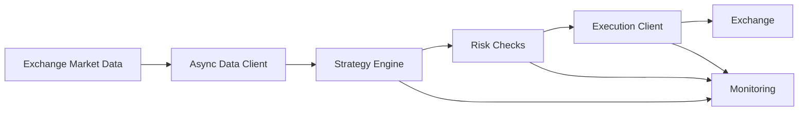

# Architecture

The bot is organized into five logical layers:

1. Market data ingestion
2. Strategy evaluation
3. Risk control
4. Order execution
5. Monitoring and operations

## Design goals

- Keep trading logic simple and auditable
- Separate exchange IO from strategy evaluation
- Make deployment repeatable through Docker
- Surface operational failures quickly through logs and monitoring
- Allow future extension into backtesting, paper trading, and AI-assisted strategy review
